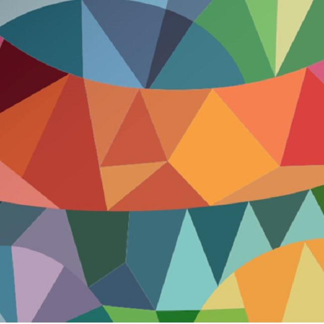

# Neural style transfer

This is a simple implementation of the neural transfer learning tutorial provided by [Pytorch](https://pytorch.org/tutorials/). The only purpose of this code was to restyle the pictures of all participants of an internal data science hackathon with the theme of the company. Turned out, lots of colleagues liked the output; so we decided to share it :-).

## Installation

You need to have a Python on your computer, preferably miniconda. For those of you riding on the linux train, you can create the required conda environment using the following command:

```{bash}
conda env create -f environment.yml
```

On windows, you can run the respective conda command that Pytorch suggests [here](https://pytorch.org/). Pytorch should be the only package that you need.

## Usage

To restyle your image, you need to have a content image (e.g. an image of you) and a style image (company design) ***of the same size***. Currently, there is a style image of Trivadis (650px*650px) available in the `data/style` folder. To use the script, simply resize your image to the same dimensions and you are good to go.

If you have your image ready, the simplest way of restyling your image is replacing my image (me.jpg) with yours and then cd into the working directory and execute the following command:

```{bash}
python restyle.py
```

If you want to restyle more images or do not want to replace my image (so kind of you :-)), you can control the following parameters:

```{bash}
 python restyle.py -h
usage: restyle.py [-h] [--content_image CONTENT_IMAGE] [--style_image STYLE_IMAGE] [--restyled_path RESTYLED_PATH] [--restyled_image_path RESTYLED_IMAGE_PATH]

Neural transfer learnig

optional arguments:
  -h, --help            show this help message and exit
  --content_image CONTENT_IMAGE
                        Path to your content files
  --style_image STYLE_IMAGE
                        Path to your style files
  --restyled_path RESTYLED_PATH
                        Path to your target directory
  --restyled_image_path RESTYLED_IMAGE_PATH
                        Name of the restyled image
```

## Results

Here a quick overview of the results I had with my image:

Conent/Input image:


Style image:



Restyled image:


## Disclaimer

No quality of the code or the outcome is guaranteed; if you need adjustments, please go ahead, clone the repo and do your thing :-).

## Credits

Credits to [Pytorch](https://pytorch.org/tutorials/) for this awesome tutorial.

## License

This code is free and open source software, licensed under MIT.
